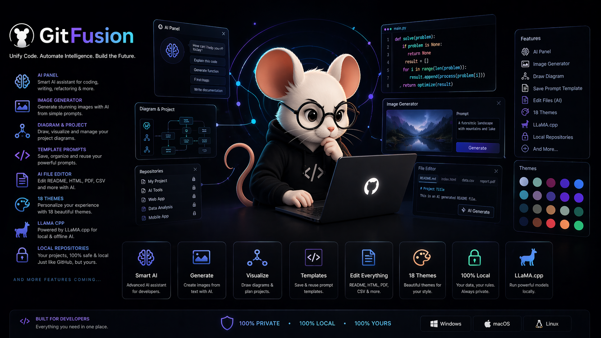
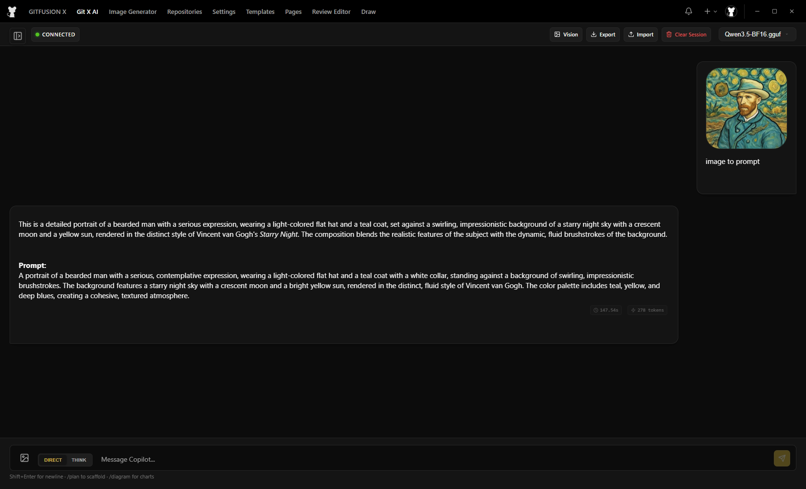
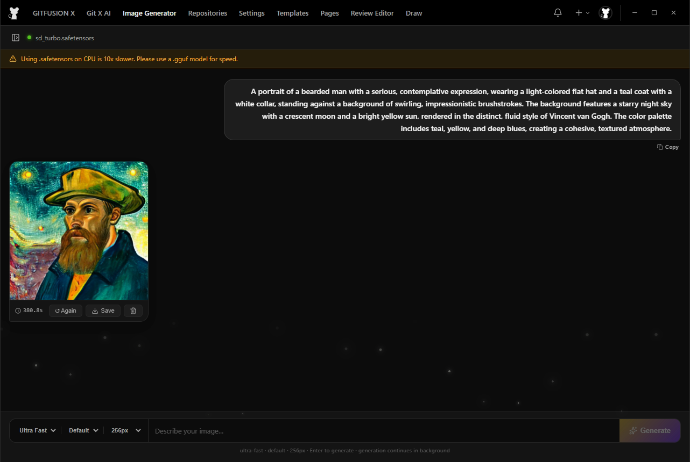
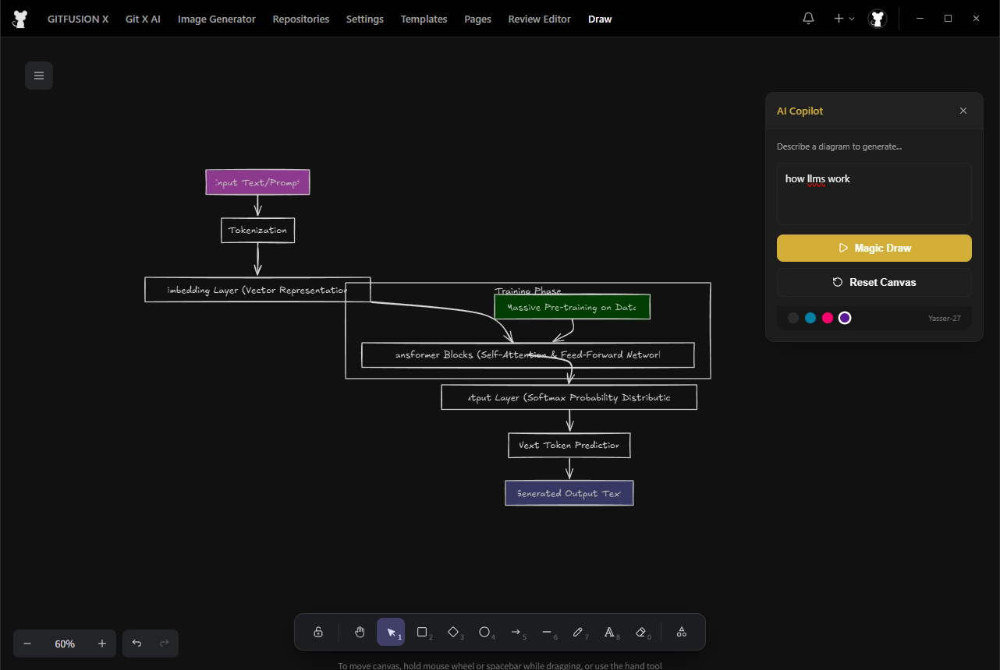
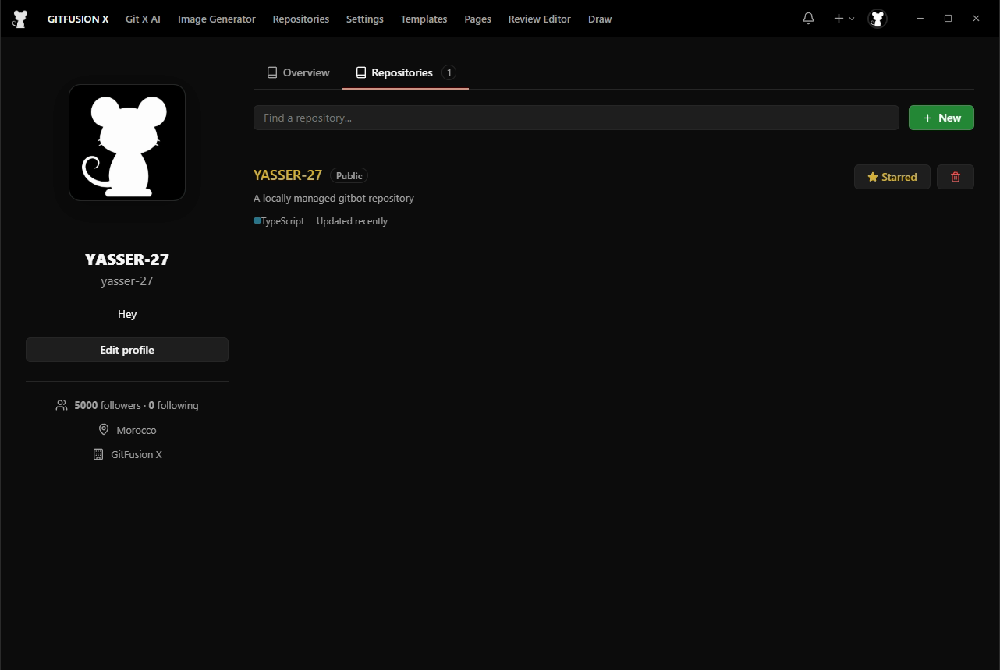
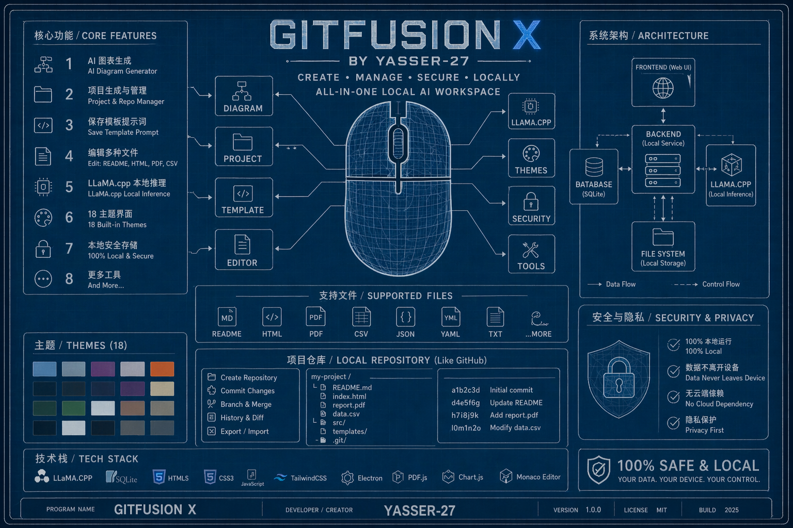

  
  <h1 align="center">GITFUSION X </h1>
  
The Ultimate Open Source Local AI Workspace

  

  <a href="#english-version">English Version</a> • <a href="#النسخة-العربية">النسخة العربية</a>

Unify Code. Automate Intelligence. Build the Future. 100% Local. 100% Private.

<h2 id="english-version">GITFUSION X </h2>

> **GITFUSION X** is a high-performance, private-first AI ecosystem built with **Electron + React + Vite**. It redefines the local workspace by combining advanced AI vision, local LLM inference via Llama.cpp, and a secure repository system. Stop waiting for the cloud—take control of your intelligence locally.

`GITFUSION X Ecosystem`

[Download for Windows](https://github.com/YASSER-27/Github/releases)

### 1. Vision Intelligence (Real Eyes)
Stop describing pixels with text. Drop any image—from complex UI designs to fine art—and let the Vision engine break it down into detailed descriptions, prompts, and actionable code snippets. It's fast, offline, and actually understands context.

### 2. Local Diffusion & Creation
Transform your thoughts into high-fidelity visuals using local diffusion models. Generate stunning artwork and design assets directly on your GPU with zero subscription fees and zero data mining.

### 3. Intelligent Drawing & Architecture
Visualize the logic before touching the keyboard. Use the integrated diagramming suite to map out project logic, system architectures, and workflows. It’s a perfect tool for planning your development cycle.

### 4. Secure Local Repositories
We built a repository system that feels just like GitHub, minus the servers. Manage all your projects in a secure, encrypted environment that lives entirely on your machine. 100% safe, 100% yours.

### 5. 18 Professional Themes
Personalize your workspace with 18 beautifully crafted themes, ranging from minimal dark modes to vibrant "Aurora" and "Cyberpunk" palettes. Designed for modern developers who value aesthetics.

| Category | Available Themes |
|----------|-----------------|
| Minimalist | Light Mode, Default Dark, GitHub Deep, Dark Pure |
| Animated Aurora | Modern Aurora, Modern Ocean, Modern Forest, Modern Rose |
| Neon & Cyberpunk| Modern Neon, Modern Synthwave, Modern Crimson, Modern Glass |
| Warm & Golden   | Modern Midnight, Amber Gold, Obsidian Gold, Sunset, Desert |

### 6. Technical Excellence
- **Frontend:** React + Vite + TypeScript for a blazing fast UI.
- **AI Core:** Llama.cpp for raw, offline inference power.
- **Privacy:** Hardened CSP headers and V8 obfuscation shield.
- **Power:** Automatic idle-sleep mode to save VRAM and battery.

---

<h2 id="النسخة-العربية">النسخة العربية</h2>

> **GITFUSION X** هو منظومة عمل ذكاء اصطناعي متكاملة، مفتوحة المصدر، ومصممة لتكون خاصة بالكامل. تم بناؤه باستخدام **Electron + React + Vite** ليعيد تعريف مساحة العمل المحلية من خلال دمج تقنيات الرؤية المتقدمة، معالجة اللغات المحلية عبر Llama.cpp، ونظام مستودعات آمن تماماً.

[تحميل GITFUSION X للويندوز](https://github.com/YASSER-27/Github/releases)

## الميزات الرئيسية

### 1. ذكاء اصطناعي بعيون حقيقية (Vision)
توقف عن وصف الصور بالكلمات. اسحب أي لقطة شاشة أو تصميم وشاهد محرك الرؤية وهو يحللها ويحولها إلى أوصاف برمجية دقيقة وأوامر جاهزة للاستخدام. كل هذا يتم محلياً دون مغادرة بياناتك لجهازك.

### 2. توليد الفن الرقمي محلياً
حول أفكارك إلى لوحات فنية وأصول تصميم عالية الجودة باستخدام موديلات الـ Diffusion المحلية. لا أرصدة، لا فلاتر سحابية، فقط قوة كرت الشاشة الخاص بك.

### 3. التخطيط الهندسي الذكي
ارسم منطق مشروعك قبل البدء في الكود. استخدم أدوات الرسم المدمجة لتخطيط بنية النظام وتدفق البيانات، مما يجعل تفكيرك منظماً ومشاريعك ناجحة منذ اللحظة الأولى.

### 4. مستودعات محلية آمنة
قمنا ببناء نظام مستودعات يشبه تجربة GitHub ولكن بدون خوادم خارجية. مشاريعك الخاصة ستبقى خاصة حقاً، مشفرة، ومخزنة على قرصك الصلب فقط.

### 5. 18 ثيم احترافي
خصص بيئة عملك بما يناسب ذوقك. يأتي GITFUSION X مع 18 ثيماً مصمماً بعناية، من الأوضاع المظلمة البسيطة إلى ألوان "النيون" و"الأورورا" النابضة بالحياة.

## الهيكلة التقنية
- **الواجهة الأمامية:** React + Vite مع دعم كامل للـ TypeScript.
- **محرك الذكاء:** يعتمد على Llama.cpp للحصول على أقصى أداء دون إنترنت.
- **الأمن:** تشفير V8 وجدران حماية CSP لحماية الكود والبيانات.
- **توفير الطاقة:** نظام سكون تلقائي (Idle Sleep) للحفاظ على موارد الجهاز والبطارية.

## المطور
صناعة وهندسة **YASSER-27**.  
مبني بدقة لتقديم إنتاجية فائقة وخصوصية لا تساوم.
