<p align="center">
  
  <h1 align="center">Gitbot</h1>
  <p align="center">Advanced Local AI Project Manager</p>
</p>
<p align="center">
  <a href="https://github.com/YASSER-27/Github/releases">
    
  </a>
</p>

<p align="center">
  <a href="#english-version">English Version</a> • <a href="#النسخة-العربية">النسخة العربية</a>
</p>

---

<h2 id="english-version">English Version</h2>

> Welcome to **Gitbot**, a professional, fully offline, and highly secure Desktop application built with **Electron + React + Vite**. Gitbot is designed as your intelligent AI copilot and version control hub, managing your code repositories and giving you instant AI insights entirely on your local machine.

[Download Gitbot windows](https://github.com/YASSER-27/Github/releases/download/v1/Gitbot.exe)

## Key Features

### 1. 100% Offline AI Inference (Llama)
- **Local & Private:** Gitbot connects directly to an onboard `llama-server.exe` instance running locally via C++. Zero telemetry, zero cloud calls, completely air-gapped processing.
- **AI Copilot & Code Generation:** A dedicated AI Chat interface lets you ideate, debug, and write code.
- **Auto-Connect Memory Tracker:** Intelligently remembers your last used local model and dynamically boots without manual path reconfiguration.
- **Instant Project Scaffolding:** Use the powerful `/plan` command in the AI Copilot. The AI will instantly generate an entire project structure and create all the necessary files simultaneously inside your repositories.

### 2. Intelligent Repository Management
- **Centralized Hub:** All your projects are stored cleanly outside the application scope in `~/.gitbot/repos`, ensuring your work is persistent and immune to application updates or uninstalls.
- **Smart Folder Imports:** Upload any local project, and Gitbot intelligently crawls and imports the files cleanly without weird folder-nesting behaviors.
- **Snapshot (Commit) System:** Save the state of your project by making a "Commit". Gitbot packages the entire state into a secure `.zip` file stored safely in the project's background `commits` folder. Revert or inspect previous states instantly.
- **Releases:** Export and compile finished projects as versions (e.g., v1.0.0) ready for deployment.

### 3. State-of-the-art UI / UX
- **Dynamic Theming Ecosystem:** A highly optimized css-variable engine allowing rapid, real-time transitions between an extensive palette of beautifully crafted environments. Available layout selections feature:

  | Category | Available Themes |
  |----------|-----------------|
  | Minimalist | Light Mode, Default Dark, GitHub Deep, Dark Pure |
  | Animated Aurora | Modern Aurora, Modern Ocean, Modern Forest, Modern Rose |
  | Neon & Cyberpunk| Modern Neon, Modern Synthwave, Modern Crimson, Modern Glass |
  | Warm & Golden   | Modern Midnight, Amber Gold, Obsidian Gold, Sunset, Desert |

- **Custom Markdown Renderer:** The integrated file viewer employs `react-markdown` with strict custom bridging protocols (`gitbot-repo://` and `gitbot-profile://`). This architecture seamlessly bypasses structural CSP firewalls, securely importing and rendering proprietary local images directly inside the documentation.
- **Persistent Interface Layout:** The user layout mimicking high-end engineering IDEs persistently maintains sidebars, files, and project states completely cleanly across system reboots.

### 4. Enterprise-Grade Security & Performance
- **Zero-Footprint Idle Saver:** The internal engine automatically goes into deep sleep mode after 5 minutes of inactivity (`--sleep-idle-seconds`), flushing VRAM and saving laptop batteries.
- **V8 Obfuscation Shield:** Core logic is scrambled using `javascript-obfuscator` during the build export, protecting proprietary logic inside the packaged ASAR archive.
- **UI Lockdown:** Native Electron developer tools (F12) and system application menus are strictly disabled on deployment to prevent reverse engineering.
- **Cross-Site Scripting (XSS) Policy:** Hardened Content-Security-Policy (CSP) headers block malicious payload execution when rendering insecure markdown documents.

| 1 | 2 | 3 | 4 | 5 |
|:---:|:---:|:---:|:---:|:---:|
| 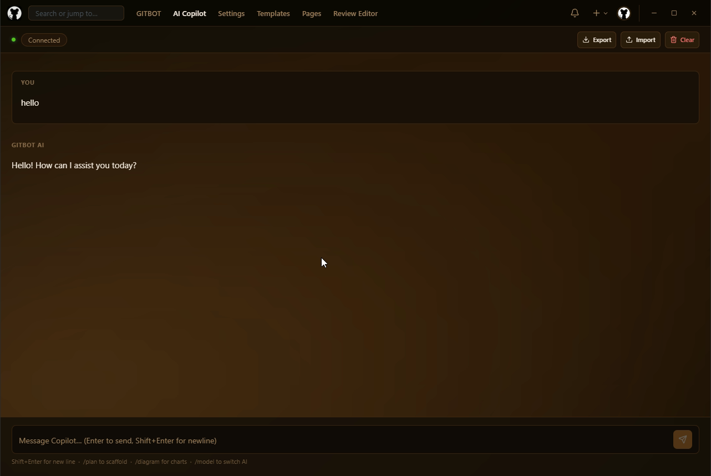 | 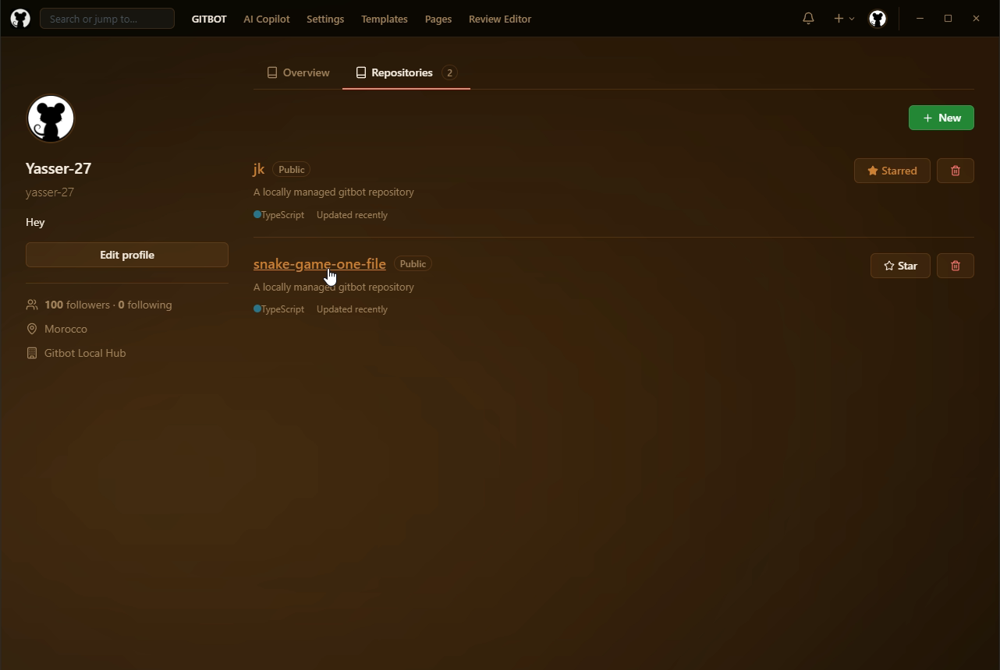 | 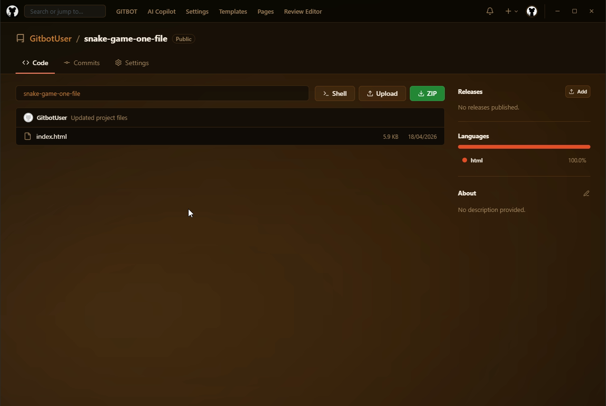 | 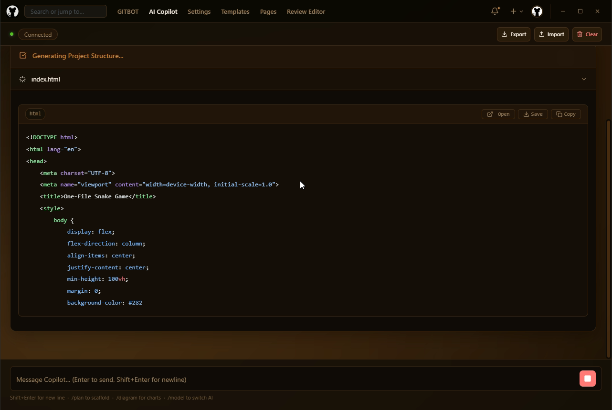 |  |

| 1 | 2 | 3 | 4 | 
|:---:|:---:|:---:|:---:|
| 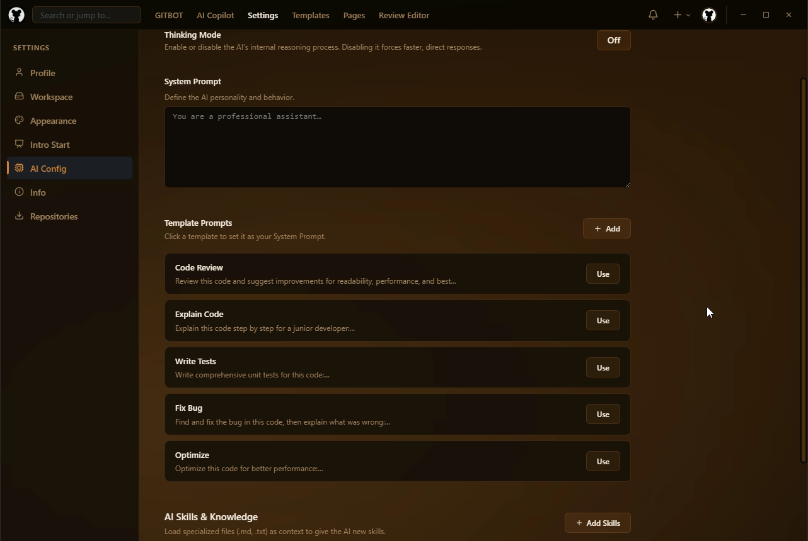 | 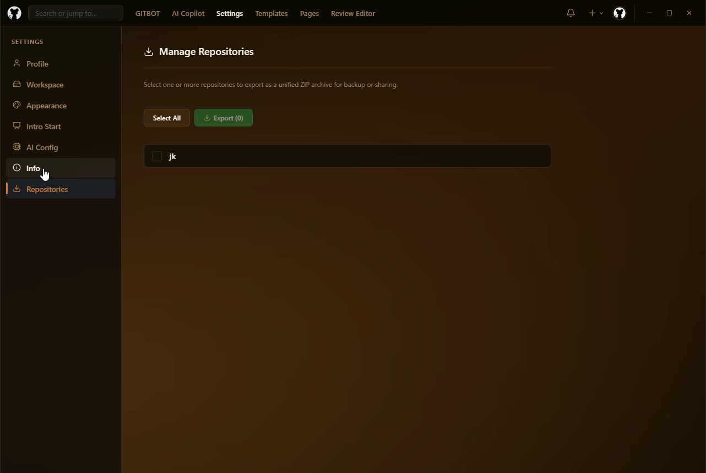 | 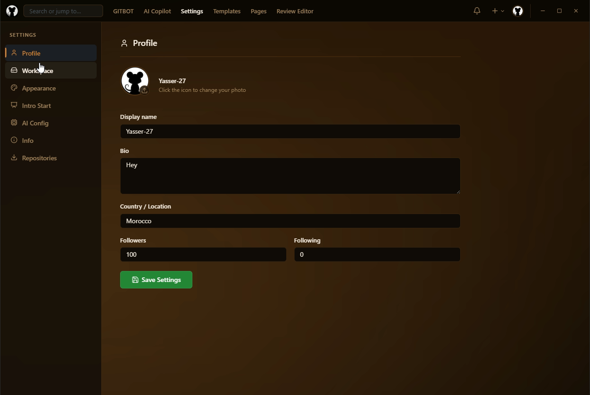 | 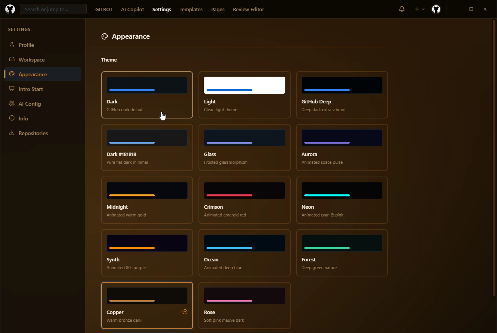 | |

| 1 | 2 | 3 | 4 | 
|:---:|:---:|:---:|:---:|
|  |  |  |  | |

| 1 | 2 | 3 | 4 |
|:---:|:---:|:---:|:---:|
|  | 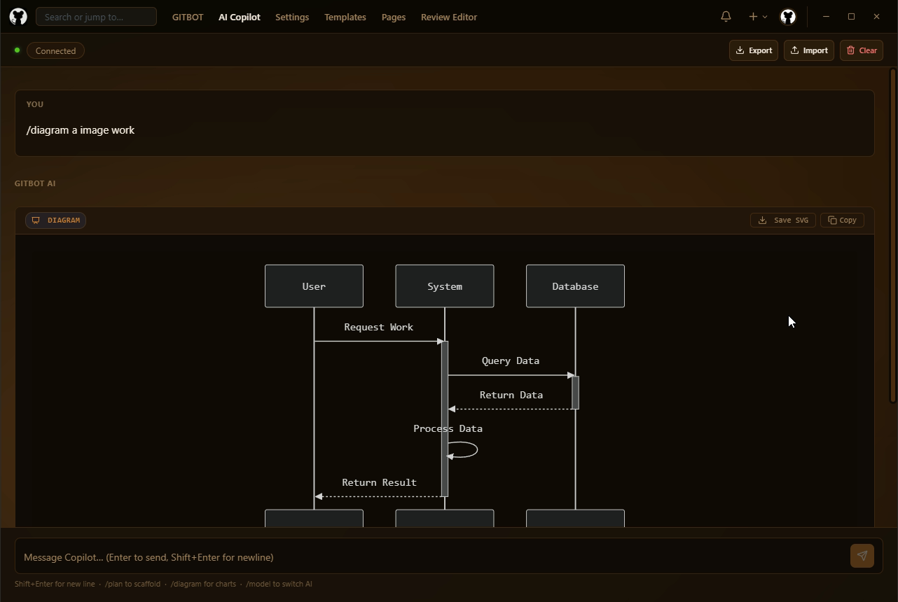 | 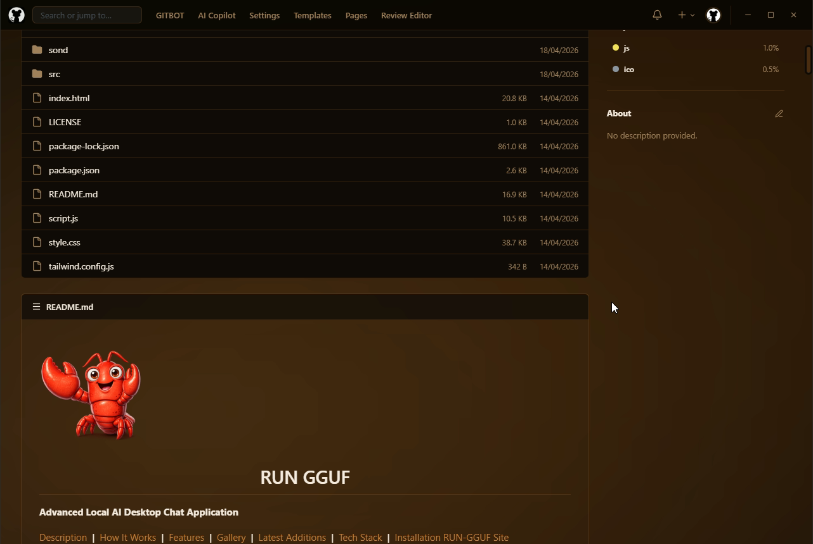 |  | |


| 1 | 2 | 3 | 4 | 
|:---:|:---:|:---:|:---:|
|  | 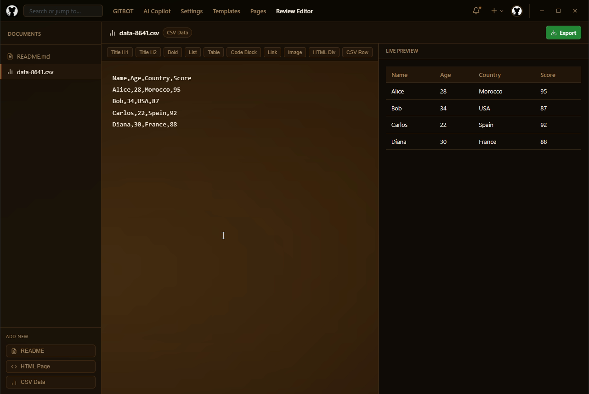 | 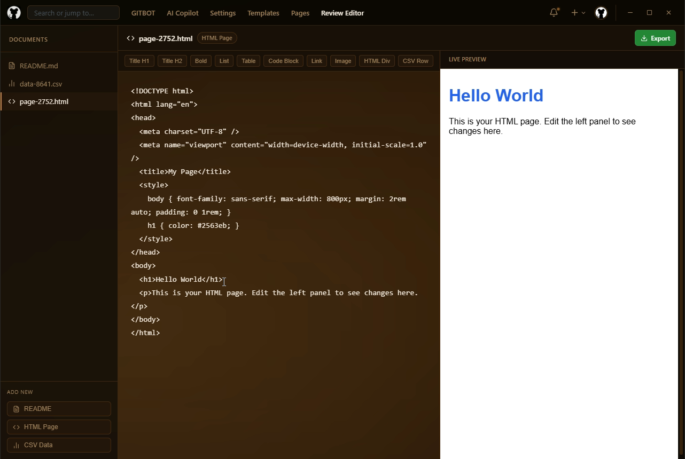 | 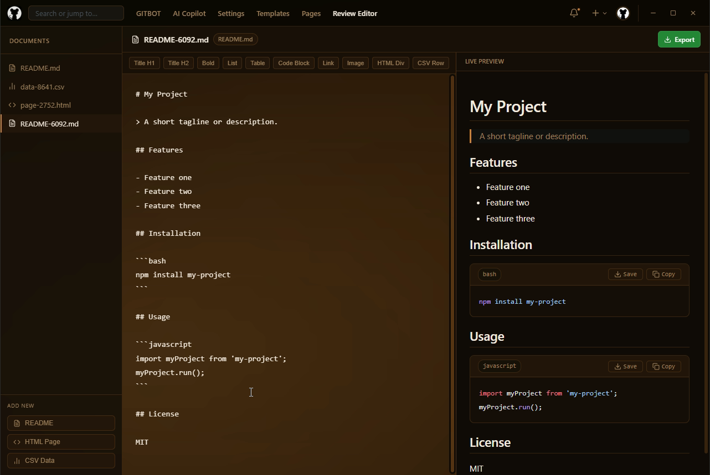 | |


<div class="container">
                <div class="title-block">
                    <h2 data-i18n="cmd_title">Shortcuts &amp; CLI</h2>
                </div>
                <div class="cmd-split">
                    <div class="cmd-card">
                        <h3 data-i18n="cmd_hotkeys">Hotkeys</h3>
                        <ul class="key-list">
                            <li><kbd>F9</kbd> <span data-i18n="key_toggle">Toggle Visibility</span></li>
                            <li><kbd>Ctrl + R</kbd> <span data-i18n="key_reload">Force Reload</span></li>
                            <li><kbd>Ctrl + F</kbd> <span data-i18n="key_search">Smart Search</span></li>
                        </ul>
                    </div>
                    <div class="cmd-card">
                        <h3 data-i18n="cmd_cli">gbot CLI</h3>
                        <ul class="cli-list">
                            <li><code>gbot commit</code> — <span data-i18n="cli_commit">Quick Snapshot</span></li>
                            <li><code>gbot status</code> — <span data-i18n="cli_status">Diff View</span></li>
                            <li><code>/plan</code> — <span data-i18n="cli_plan">AI Scaffolding</span></li>
                        </ul>
                    </div>
                </div>
            </div>
            

## Technical Architecture

- **Frontend:** React + Vite, fully statically typed with TypeScript. Uses `lucide-react` for beautiful vector icons.
- **Backend (Node.js/Electron):** The `electron/main.ts` orchestrates the local OS bridging. It manages:
  - File archiving and zipping utilizing `archiver` package.
  - Spawning the background AI processes with configured multithreading (`--ctx-size 8192`, `--parallel 1`, etc.).
  - Bypassing standard secure web contexts via `protocol.registerSchemesAsPrivileged` to map system folder paths perfectly.
- **AI Connectivity:** Communicates with the AI via a fetch API wrapper (`AIContext.tsx`) that intercepts streaming chunks and processes them flawlessly even if the AI randomly cuts out. A heavily optimized Fallback JSON parser reliably rebuilds interrupted AI generation streams.

## How to run locally

### 1. Setup Environment
Ensure you have Node.js installed. Gitbot utilizes models locally, you can select them dynamically in the settings or place a default `.gguf` AI model at the path: `cpp/gemma-4-E2B-it-Q4_K_M.gguf`. (A compliant `llama-server.exe` must exist in `cpp/`).

### 2. Start Developing
```bash
npm install
npm run dev
```
Wait 2 to 3 seconds for the Main process to spawn the AI server in the background.

### 3. Build & Package
```bash
npm run build
npm run dist
```
This prepares the React UI, statically compiles the Vite output into `dist/`, executes javascript obfuscator for backend security, and prepares the Electron binaries to be packed into a portable executable.

## Developer
Engineered & Designed by **YASSER-27**.
Built with precision for uncompromised local AI productivity.

---

<h2 id="النسخة-العربية">النسخة العربية</h2>

> مرحبًا بك في **Gitbot**، تطبيق سطح مكتب احترافي، يعمل بالكامل دون الحاجة للإنترنت، وهو محمي ومؤمن بشدة بفضل برمجته عبر **Electron + React + Vite**. تم تصميم Gitbot ليكون المساعد الذكي لإدارة شفراتك ومستودعاتك البرمجية وتوفير ميزة الذكاء الاصطناعي على جهازك المحلي فقط.

[تحميل تطبيق Gitbot للويندوز](https://github.com/YASSER-27/Github/releases/download/v1/Gitbot.exe)

## الميزات الرئيسية

### 1. ذكاء اصطناعي محلي 100% (Llama)
- **خصوصية مطلقة:** يتصل البرنامج مباشرة بخادم `llama-server.exe` مدمج ومبرمج بالـ C++. بدون أي تتبع، أو اتصال سحابي، مما يجعله محميًا ومعزولًا كليًا.
- **توليد الكود البرمجي والمساعدة:** من خلال واجهة المحادثة المدمجة للذكاء الاصطناعي يمكنك كتابة الأكواد، طرح الأسئلة أو حل المشاكل البرمجية.
- **ذاكرة النماذج التلقائية:** يحفظ خادم البرنامج بذكاء مسار آخر نموذج ذكاء اصطناعي محلي استخدمته ليقوم بتشغيله فورًا عند الفتح القادم بدون إعداد يدوي للنموذج.
- **بناء المشاريع التلقائي:** يمكنك استخدام الأمر القوي `/plan` داخل المحادثة. أين سيقوم الذكاء الاصطناعي ببناء وبدء هندسة مشروع كامل وتوليد جميع الملفات المرافقة داخل المستودع بضغطة زر.

### 2. إدارة مستودعات الأكواد بذكاء
- **المركز الرئيسي:** جميع ملفات مشاريعك تُحفظ بشكل نظيف بمسار `~/.gitbot/repos` خارج صلاحيات البرنامج الأساسية، لضمان استمرارية أمان ملفاتك حتى بعد حذف أو تحديث البرنامج.
- **استيراد المجلدات الذكي:** ارفع أو اسحب أي مشروع محلي، ليقوم Gitbot بقرائته وتهيئته أوتوماتيكيًا.
- **نظام الحفظ اللحظي (Commit System):** يمكنك حفظ الوضع الحالي لمشروعك عبر أخذ "Commit". حيث يقوم Gitbot بسحب حالة مشروعك وحفظها كملف مجمد `.zip` في ملف داخلي آمن يسمى `commits`. يمكنك دائمًا العودة لأي حالة سابقة واسترجاع مشاريعك ببساطة.
- **الإصدارات (Releases):** تصدير المجلد النهائي من المشاريع كإصدار نهائي (مثل: v1.0.0) وتهيئته للنشر.

### 3. واجهة رسومية بمعايير حديثة كلياً
- **بيئة ثيمات متجاوبة وديناميكية:** نظام برمجي محسن يسمح بالانتقال الفوري والسلس بين مجموعة واسعة من البيئات البصرية المصممة بعناية فائقة. تتضمن قائمة بيئات العمل الاحترافية المتاحة:

  | الفئة | الثيمات المتاحة |
  |-------|-----------------|
  | التصميم البسيط (Minimalist) | الوضع المضيء، المظلم الافتراضي، GitHub Deep، Dark |
  | الألوان الطبيعية المتحركة | Aurora، Ocean، Forest، Rose |
  | النيون والتصاميم الحيوية | Neon، Synthwave، Crimson، Glass |
  | التصاميم الذهبية الدافئة | Midnight، Amber Gold، Obsidian Gold، Sunset، Desert |

- **قارئ المارکداون الخاص (Markdown Renderer):** قارئ ملفات مبرمج ومدمج يتزامن مع خطوط بروتوكولات محلية آمنة (`gitbot-repo://` و `gitbot-profile://`). هذه الخاصية تتيح فك جدران الحماية الصارمة من أجل استدعاء وقراءة الصور التابعة للمشاريع داخل الملفات النصية بانسيابية وأمان.
- **تخطيط هندسي دائم:** منصة العمل مصممة لتحاكي بيئات التطوير المتكاملة (IDE) الاحترافية. حيث يحتفظ النظام بوضعية النوافذ والشاشات بعد كل دورة تشغيل لضمان استمرارية العمل باحترافية.

### 4. حماية وتوفير طاقة بمعايير المؤسسات
- **نظام السكون لتوفير الموارد:** محرك النظام يقفز فورًا لحالة نوم عميق بعد مرور 5 دقائق من الخمول، للحد من حجز كروت الشاشة (VRAM) ومنع استهلاك بطارية الحواسيب.
- **جدار حماية (Obfuscation):** في النسخ المخصصة للنشر، يتم تشفير أجزاء البرمجة العميقة بواسطة `javascript-obfuscator` لتحويل الشفرات الهجينة لطلاسم معمّاة تمنع سرقة ميكانيكية عمل البرنامج واستخراج أكواده.
- **غلق واجهات التطوير:** للنسخة المصدرة، يغلق البرنامج جميع خيارات قوائم ويندوز التخريبية ويمنع الوصول لشاشات التطوير (F12) كلياً لحماية البيانات.
- **وقاية ضد حقن الثغرات (CSP/XSS):** حوائط أمنية ديناميكية للمحتوى تحظر أي أسطر غريبة أو محاولات إدراج و حقن سكربتات ضارة داخل الملفات الكتابية للمشاريع لمنع هجمات (XSS).

## الهيكلة التقنية
- **الواجهة الأمامية:** مُصممة باستخدام مكتبة React ومجمّع سريع (Vite) وببنية Typescript وتعتمد على إيقونات `lucide-react`.
- **الواجهة الخلفية (Node.js/Electron):** يقوم ملف الجسر (`main.ts`) بالتنسيق المباشر والمزامنة مع خصائص نظام التشغيل:
  - معالجات الأرشفة للمشاريع بواسطة `archiver`.
  - إدارة العمليات الخلفية الخاصة بالـ AI وتحديد الأنوية المستعملة.
  - تخطي سياقات المتصفح الآمنة لربط الملفات باستخدام قنوات `protocol.registerSchemesAsPrivileged`.

## كيفية التشغيل (للمطورين)

### 1. إعداد البيئة
يرجى التأكد من توفر Node.js. برنامج Gitbot يستخدم محركات نماذج الـ AI محلياً، ويوصى بأن يتم تحميل نموذج بصيغة `.gguf` (مثل Gemma).

### 2. بدء التطوير (Dev)
```bash
npm install
npm run dev
```
سيقوم البرنامج بالإقلاع مع الواجهة الجانبية والقيام بتشغيل الـ Llama Server في الخلفية باختيار مسار النموذج المحفوظ لديك أوتوماتيكيًا.

### 3. الصقل والبناء (Build)
```bash
npm run build
npm run dist
```
هذا الأمر مخصص لتجميع جميع صفحات الـ UI وتسليح الواجهة الخلفية عبر الـ Obfuscator وتجهيز ملف البرنامج كملف تنفيذي احترافي قابل للنشر.

## المطور
صناعة وهندسة **YASSER-27**.  
مبني بدقة والتزام لتقديم إنتاجية فائقة وخدمة ذكاء اصطناعي محلي غير مسبوقة!
